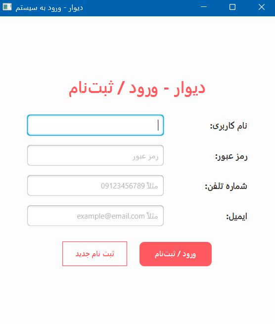
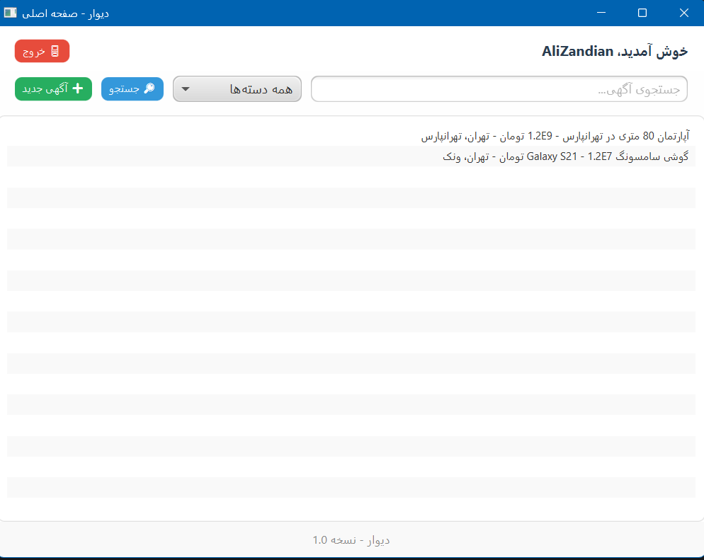
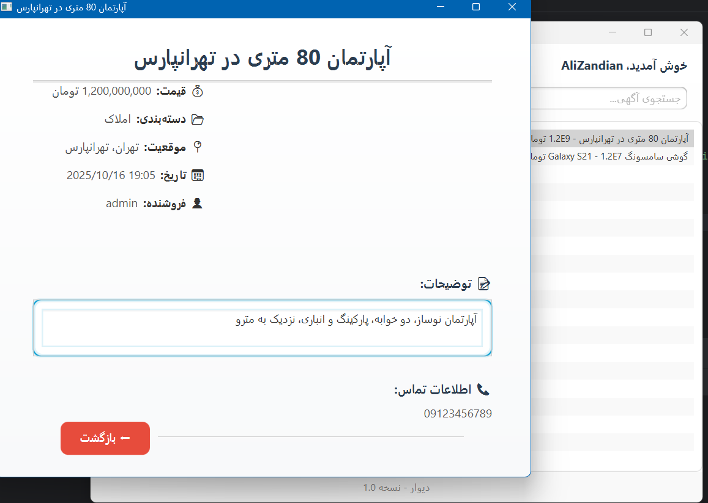
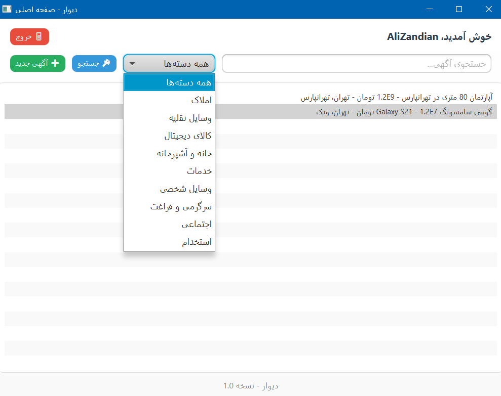
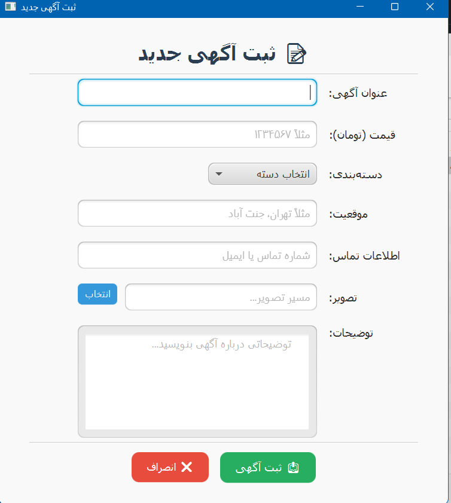
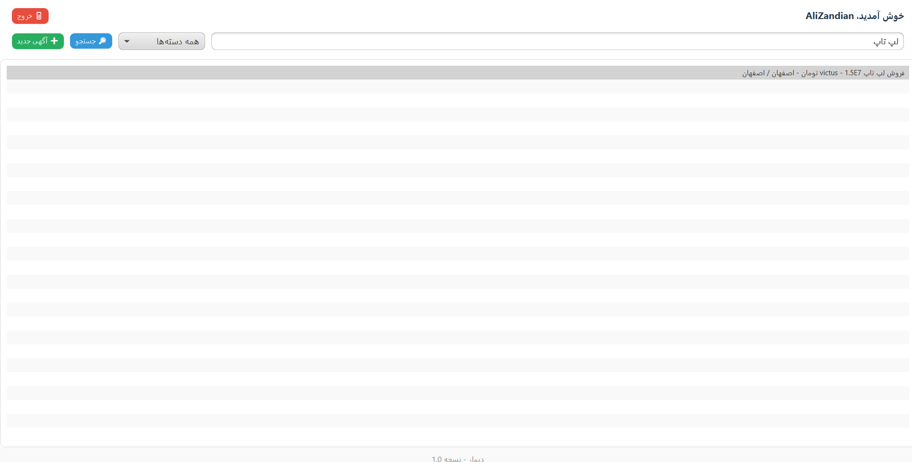
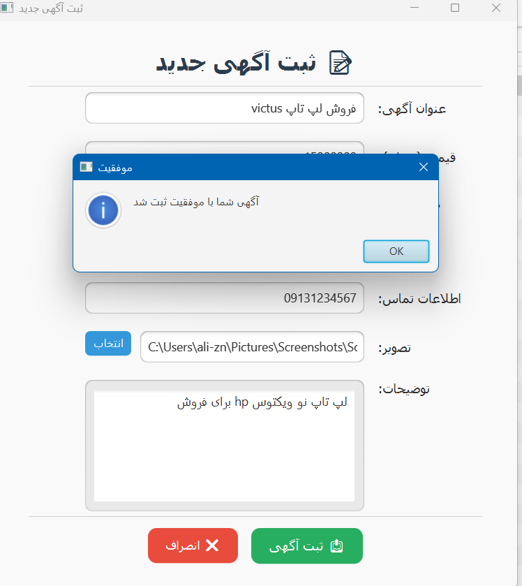
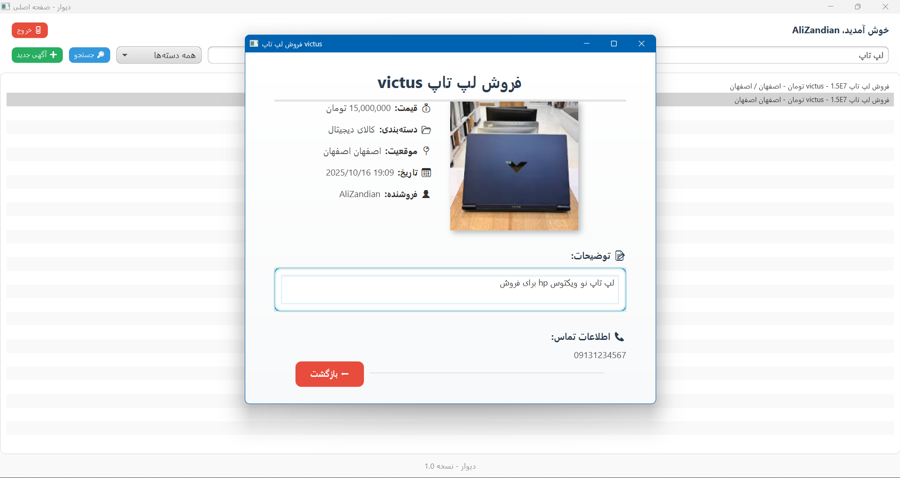

# 🏠 DivarFX — AP Advanced Programming Workshop Project

**DivarFX** is a simple, JavaFX-based desktop application for **classified ads**, developed as a **course project** for the *Advanced Programming Workshop (AP)* course at the **University of Isfahan** — *Winter 2023*.  

This project follows a clean **Model–View–Controller (MVC)** architecture and applies basic **OOP principles** for modularity and maintainability.

---

## 🚀 Key Features
- 📝 **User registration and login**
- 📌 **Create new listings** with:
  - Title
  - Description
  - Contact number
  - Image upload
- 📂 **Category filtering**:
  - All Categories
  - Real Estate
  - Vehicles
  - Digital Products
  - Home & Kitchen
  - Services
  - Personal Items
  - Entertainment & Leisure
  - Social
  - Jobs
- 🔍 **Search listings** by keywords
- 💾 **Local database storage** for users and listings
- 🖥️ **JavaFX UI** with responsive FXML layouts

---

## 🧩 Tech Stack
| Layer | Technology |
|-------|-------------|
| 🖥️ UI | JavaFX, FXML |
| 🧠 Logic | Java (MVC pattern, OOP principles) |
| 💾 Database | Local in-app database (`ListingDatabase.java`) |
| ⚙️ IDE | IntelliJ IDEA |

---

## 📂 Project Structure
DivarFX/
├── src/

│ ├── controller/ # JavaFX controllers (handles UI actions)

│ ├── model/ # Data models and local database

│ └── DivarApplication.java # Main launcher class

├── resources/

│ └── fxml/ # FXML layout files

├── screenshots/ # Project screenshots (S1.png to S8.png)

└── README.md

---

## 🧠 Architecture Overview
This project uses **MVC (Model–View–Controller)** separation:

- **Model:** `Listing`, `User`, `ListingDatabase` — handles data and business logic  
- **View:** FXML layouts under `resources/fxml` — defines UI components  
- **Controller:** `controller/` classes — manage user interactions and update model/view  

---

## 💾 Database
The project uses a **local in-app database** (`ListingDatabase.java`) to store:

- User information (username, password)
- Listings (title, description, contact, image, category)

No external database setup is required.

---

## 🖼️ Screenshots

  
  
  
  

  
  
  
  

---

## ▶️ How to Run

Clone the repository:

bash
git clone https://github.com/username/Divar-FX.git
cd Divar-FX

1.Open in IntelliJ IDEA (or any Java IDE)

2.Ensure JDK 17 or higher is installed

3.Run the main class: DivarApplication.java

4.Start using the app: register, login, create and browse listings

---

# 🎓 Academic Context

- 📘 Developed as a simple course project for the Advanced Programming Workshop (AP) course

- 🏫 University of Isfahan — Winter 2023

- 👨‍💻 Individual coursework using JavaFX

--- 

# 💬 Author

- Ali Zandian

- 🎓 Computer Engineering Student — University of Isfahan

- 📫 GitHub: @alizn7

---
# 🪴 License

This project is open for educational and non-commercial use.
